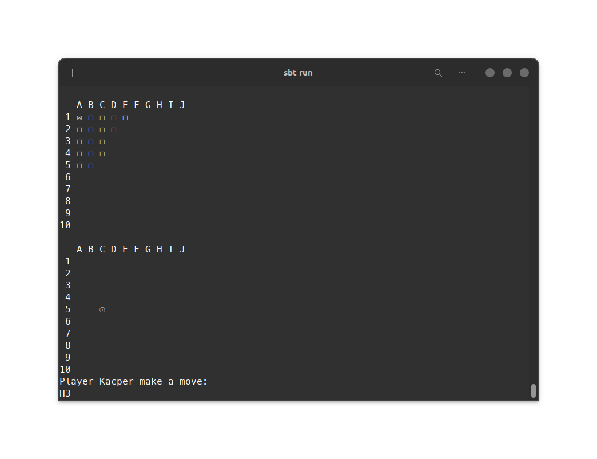

# Sea battle game
Simple multiplayer game, that allows to play sea battle for two players on one screen.

## Technologies
Project is created with:

- scala version: 3.2.0
- cats-core library version: 2.8.0
- cats-effect library version: 3.3.14
- munit-cats-effect-3 library version: 1.0.7

## Setup
To run this project, go to current project directory and run using:

``
$ sbt run
``

## Description

The project is a simple turn based variations about sea battle game, for two players on one screen.

The game is consist of placing your ships on the board and the destroying all your opponent's ships. 

## Sample image of a game

## Todos

- websockets
- tests
